# Viemmo: Privacy-First Vietnamese LLM Fine-Tuning on Consumer Hardware

Viemmo is an academic group project investigating how open-weight instruction models can be adapted for Vietnamese, evaluated reproducibly, and kept deployable in a local/offline environment. The project does not train a foundation model from scratch. It builds a controlled supervised fine-tuning pipeline around frozen 4-bit base models and lightweight LoRA adapters.

The study began with the English-dominant OLMo-2-0425-1B-Instruct model on a 4 GB NVIDIA GPU. After the baseline exposed a large Vietnamese capability gap, the comparison was expanded to multilingual Qwen2.5 models at 1.5B, 14B, and 32B parameters. This creates three experimental axes:

- English-dominant versus multilingual base models;
- model scale from approximately 1.5B to 32.5B parameters;
- CUDA QLoRA on low-VRAM hardware versus Apple MLX LoRA on larger unified-memory hardware.

> **Current status:** Dataset preparation, the tiny-overfit gate, CUDA pilot training, MLX adapter training, and A–J comparative generation are represented by repository artifacts. Blinded human comparison, dedicated privacy/security experiments, and a genuine merged GGUF deployment remain incomplete. The current A–J score matrix was produced by `gpt-4o-mini` as an LLM judge.

## Group report information

Complete this table before submission.

| Field | Value |
|:---|:---|
| Course / module | _To be completed_ |
| Project group | _To be completed_ |
| Members and student IDs | _To be completed_ |
| Supervisor / lecturer | _To be completed_ |
| Institution | _To be completed_ |
| Submission date | _To be completed_ |
| Repository commit used for the report | Run `git rev-parse HEAD` |

## Project overview

The project has five connected goals:

1. build a reviewed Vietnamese SFT corpus without private or scraped user data;
2. validate an end-to-end parameter-efficient training path on consumer hardware;
3. compare base and adapted models under a frozen Vietnamese benchmark;
4. measure capability, output control, latency, memory, privacy, and security behavior;
5. retain an offline deployment path in which base weights, datasets, and adapters remain outside Git and under local control.

The main research artifact is therefore not only a trained adapter. It is the complete chain from data governance and contamination prevention to quantized training, adapter verification, blind evaluation, statistical reporting, and eventual offline deployment.

## Abstract

This pilot evaluates parameter-efficient Vietnamese supervised fine-tuning across four open-weight model scales. The training corpus contains 2,000 project-authored and independently reviewed records, split by task group into 1,800 training and 200 validation examples. The CUDA branch uses Hugging Face Transformers, bitsandbytes NF4 quantization, PEFT LoRA, completion-only loss masking, gradient checkpointing, and a paged 8-bit optimizer. The Apple Silicon branch uses pre-quantized MLX Qwen checkpoints and LoRA adapters over the final 16 transformer blocks. All base and adapted variants are evaluated on the same frozen 30-prompt Vietnamese benchmark.

The tiny OLMo experiment successfully validated the learning and adapter lifecycle: response-token accuracy rose from `53.28%` to `99.96%`, the adapter reloaded in a separate process, and 28 of 30 training targets were reproduced. The larger comparison shows that base-model selection had a stronger effect than the single pilot SFT pass. Under the current LLM-judge protocol, OLMo adaptation was approximately tied with its base (`+0.073`), while the Qwen adapters scored below their corresponding bases (`-0.154` to `-0.240`). At the same time, adapted models generated shorter responses and reached the 256-token ceiling less often.

The evidence supports a narrower conclusion than “fine-tuning improves Vietnamese quality”:

> Viemmo demonstrates a reproducible, low-resource Vietnamese adaptation architecture, but the present data and training configurations improve output control more reliably than held-out model quality. Multilingual base-model selection remains the dominant factor in this pilot.

## Research questions and current answers

| Research question | Current answer | Evidence status |
|:---|:---|:---|
| **RQ1.** Does the pilot SFT dataset improve held-out Vietnamese quality? | Not reliably. OLMo was effectively tied; all evaluated Qwen adapters regressed under the current judge. | Provisional: one benchmark, one seed, one LLM judge |
| **RQ2.** How important is the base model's native multilingual capability? | Qwen2.5-1.5B base outscored the OLMo base by `+1.053` on the five-dimension mean. This comparison favors multilingual model selection but does not isolate pretraining language coverage from architecture and tokenizer differences. | Supported descriptively within this benchmark |
| **RQ3.** Can useful adaptation experiments run on consumer hardware? | Yes for the 1B–1.5B CUDA experiments. Measured peak training allocation stayed below 3 GB. | Supported for the recorded hardware and configurations |
| **RQ4.** Does adaptation change efficiency and output behavior? | Yes. Tuned variants produced shorter answers, lower prompt latency, and fewer token-ceiling hits, although tokens/second usually fell slightly. | Supported by recorded generation summaries |
| **RQ5.** Is the complete workflow private, secure, and offline? | Not yet demonstrated. Training and local inference can be offline, but the current cross-variant judge uses the OpenAI API, and dedicated extraction/security studies are unfinished. | Open question |

## Project status by research component

| Component | Status | Main evidence |
|:---|:---:|:---|
| Local model storage and checksum recording | Complete | `Viemmo-storage/upstream/`, [`manifests/model-checksums/`](manifests/model-checksums/) |
| Frozen 30-prompt Vietnamese baseline | Complete | [`data/evaluation/`](data/evaluation/), [`results/evaluation/baseline/`](results/evaluation/baseline/) |
| Tiny SFT data and overfit gate | Complete | [`data/training/tiny-sft-v1.jsonl`](data/training/tiny-sft-v1.jsonl), [`results/evaluation/tiny-overfit-verification.json`](results/evaluation/tiny-overfit-verification.json) |
| Reviewed 2,000-record pilot corpus | Complete and frozen | [`data/manifests/pilot-sft-v1.json`](data/manifests/pilot-sft-v1.json), [`docs/data-card.md`](docs/data-card.md) |
| OLMo and Qwen1.5B CUDA QLoRA | Complete | PEFT adapters and training summaries under `Viemmo-storage/adapters/` |
| Qwen14B and Qwen32B MLX LoRA | Adapter artifacts complete | MLX adapters and checkpoints through iteration 600 |
| A–J deterministic generation | Complete | [`results/evaluation/variants/`](results/evaluation/variants/) |
| Cross-variant scoring and analysis | Provisional | LLM-judge matrix and [`results/reports/variant_comparison_report.json`](results/reports/variant_comparison_report.json) |
| Blinded multi-reviewer human evaluation | Pending | Preparation tooling exists; completed scores are absent |
| Dedicated canary extraction and security attack suite | Pending | Data policy and canary files exist; final experiment reports are absent |
| Merged GGUF / llama.cpp deployment | Not validated | Variant D currently does not represent a real merged GGUF run |

## Project contributions

The project contributes:

- a reviewed Vietnamese SFT dataset workflow with schema validation, Unicode normalization, group-aware splitting, PII checks, duplicate detection, and held-out contamination checks;
- a frozen six-category Vietnamese benchmark with a stable canonical-LF SHA-256 checksum;
- CUDA QLoRA experiments on a 4 GB NVIDIA GPU and MLX LoRA experiments on a 32 GB Apple Silicon system;
- a ten-variant comparison design spanning base, overfit, adapted, and intended deployment conditions;
- reproducible training, evaluation, blind-review, checksum, and reporting scripts;
- evidence that a successful overfit gate does not imply generalization, and that base-model selection can dominate small-dataset adaptation.

## End-to-end system architecture

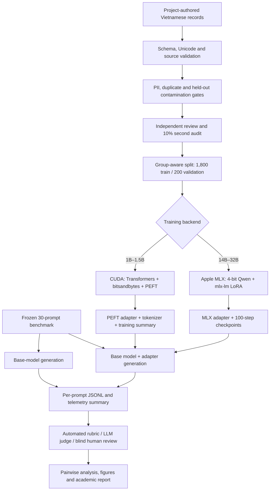

The frozen benchmark is outside the training path. The dataset split is performed by `group_id`, not individual record, so ten related examples remain in the same partition.

## Base-model architecture

| Model | Transformer class | Approx. parameters | Decoder blocks | Hidden / FFN width | Attention heads / KV heads | Context | Training backend |
|:---|:---|---:|---:|:---:|:---:|---:|:---|
| OLMo-2-0425-1B-Instruct | `Olmo2ForCausalLM` | 1.486B | 16 | 2,048 / 8,192 | 16 / 16 | 4,096 | CUDA NF4 + PEFT |
| Qwen2.5-1.5B-Instruct | `Qwen2ForCausalLM` | 1.545B | 28 | 1,536 / 8,960 | 12 / 2 | 32,768 | CUDA NF4 + PEFT |
| Qwen2.5-14B-Instruct-4bit | `Qwen2ForCausalLM` | ~14.7B | 48 | 5,120 / 13,824 | 40 / 8 | 32,768 | Apple MLX, 4-bit group size 64 |
| Qwen2.5-32B-Instruct-4bit | `Qwen2ForCausalLM` | ~32.5B | 64 | 5,120 / 27,648 | 40 / 8 | 32,768 | Apple MLX, 4-bit group size 64 |

OLMo uses standard multi-head attention with the same number of query and key/value heads. The Qwen models use grouped-query attention, which reduces the dimensions of `k_proj` and `v_proj` relative to `q_proj` and `o_proj`.

### Neural-network structure

Unlike the RNN classifier architecture in the example, these models do not use batch normalization, global pooling, or a fixed three-class output layer. They are autoregressive causal language models. Every token position produces a probability distribution over the complete tokenizer vocabulary, and generation repeatedly selects the next token.

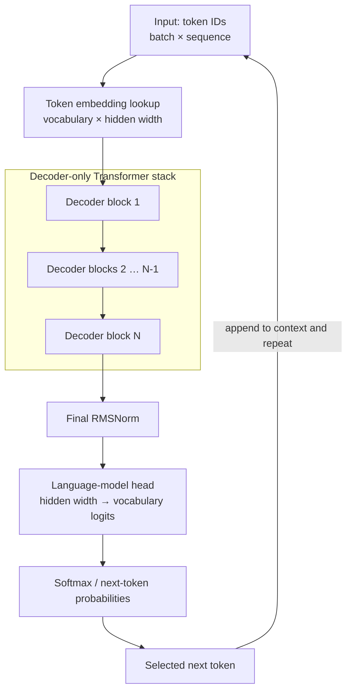

The stack depth and hidden width depend on the selected base model:

- OLMo: 16 blocks with 2,048-dimensional hidden states;
- Qwen2.5-1.5B: 28 blocks with 1,536-dimensional hidden states;
- Qwen2.5-14B: 48 blocks with 5,120-dimensional hidden states;
- Qwen2.5-32B: 64 blocks with 5,120-dimensional hidden states.

### Qwen2.5 decoder block

Qwen2.5 uses pre-normalization, rotary position embeddings, grouped-query causal self-attention, and a gated SwiGLU feed-forward network.

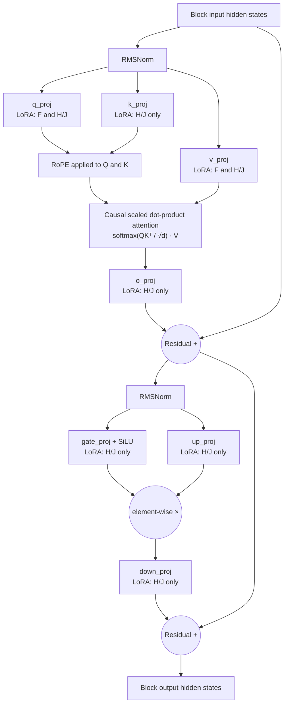

For Variant F, `q_proj` and `v_proj` receive LoRA updates in all 28 Qwen1.5B blocks. For Variants H and J, all seven labeled projections receive LoRA updates, but only in the final 16 blocks.

### OLMo2 decoder block

OLMo2 uses the same attention and SwiGLU building blocks but places RMSNorm after each sublayer output before the residual addition. It also applies dedicated RMSNorm operations to the projected query and key tensors.

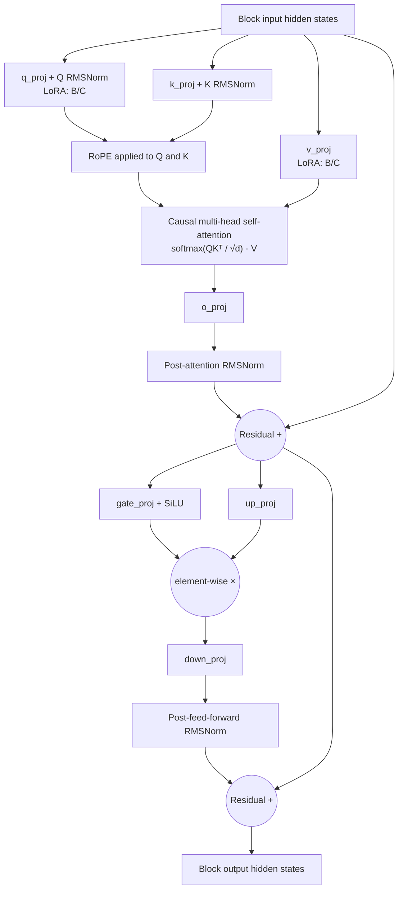

Variants B and C add rank-8 LoRA matrices to `q_proj` and `v_proj` in every one of the 16 OLMo blocks. Embeddings, key/output projections, feed-forward projections, normalization weights, and the language-model head remain frozen.

## Fine-tuned variant architecture diagrams

The following diagrams cover every trained model variant: B, C, F, H, and J. Base-only Variants A, E, G, and I and the unvalidated deployment Variant D are intentionally excluded.

### Variant B: OLMo tiny-overfit LoRA

Variant B uses the complete 16-block OLMo network, but trains only the Q/V LoRA paths. Its purpose is to prove that the training, saving, reloading, and memorization pipeline works.

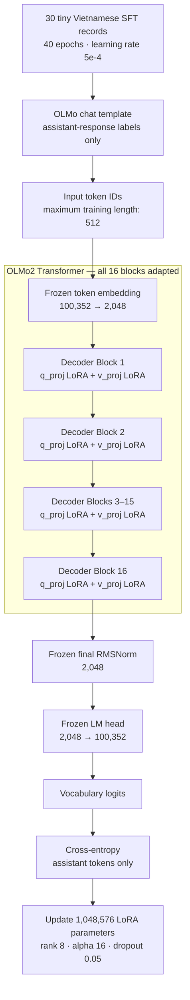

### Variant C: OLMo Vietnamese pilot LoRA

Variant C uses the same neural architecture as Variant B but replaces the memorization experiment with the reviewed pilot corpus, validation checkpoints, and early stopping.

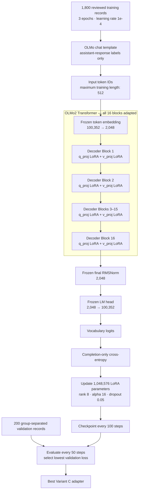

### Variant F: Qwen2.5-1.5B Vietnamese pilot LoRA

Variant F keeps the CUDA QLoRA training design but applies it to Qwen's 28-block grouped-query Transformer. Because Qwen has only two key/value heads, its V projection is narrower than its Q projection.

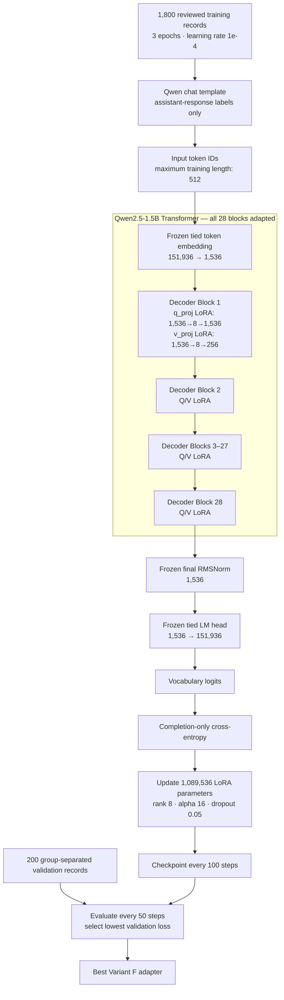

### Variant H: Qwen2.5-14B final-16-block MLX LoRA

Variant H uses a pre-quantized 4-bit Qwen14B checkpoint. The first 32 blocks remain completely frozen; every compatible attention and feed-forward projection receives LoRA in blocks 33–48.

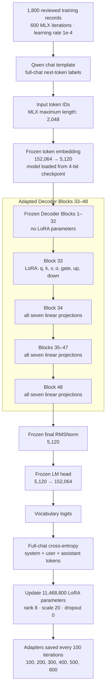

Within every adapted 14B block:

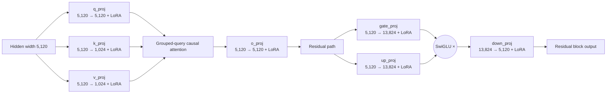

### Variant J: Qwen2.5-32B final-16-block MLX LoRA

Variant J uses the same executed MLX method as H, but the frozen prefix contains 48 blocks and the feed-forward network is twice as wide.

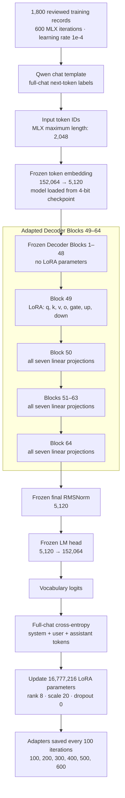

Within every adapted 32B block:


### Fine-tuned variant comparison

| Variant | Base model | Adapted blocks | LoRA targets | Loss scope | Trainable parameters |
|:---:|:---|:---:|:---|:---|---:|
| B | OLMo 1.486B | 16 / 16 | Q and V | Assistant only | 1,048,576 |
| C | OLMo 1.486B | 16 / 16 | Q and V | Assistant only | 1,048,576 |
| F | Qwen 1.545B | 28 / 28 | Q and V | Assistant only | 1,089,536 |
| H | Qwen ~14.7B | Final 16 / 48 | Q, K, V, O, gate, up, down | Full chat | 11,468,800 |
| J | Qwen ~32.5B | Final 16 / 64 | Q, K, V, O, gate, up, down | Full chat | 16,777,216 |

## Fine-tuning architecture

### Low-rank update

All base-model weights remain frozen. For an adapted linear projection, LoRA adds a low-rank path:

```text
y = W x + s · B(Ax)
```

`W` is the frozen base matrix, while `A` and `B` are the only trainable matrices. Rank `r = 8` makes the update much smaller than full-parameter training. The PEFT branch uses `lora_alpha = 16`, giving the conventional scale `alpha / r = 2`. The stored MLX adapters use the MLX scale value `20.0` directly.

### CUDA QLoRA branch: OLMo and Qwen2.5-1.5B

The CUDA implementation is in [`src/viemmo/training/trainer.py`](src/viemmo/training/trainer.py).


Key implementation details:

- the base model is loaded in NF4 4-bit with double quantization;
- compute uses BF16 when supported and FP16 otherwise;
- `prepare_model_for_kbit_training` freezes and prepares the quantized base;
- gradient checkpointing reduces activation memory;
- batch size `1` with `16` accumulation steps gives an effective batch of `16` sequences;
- the custom collator locates the assistant delimiter and masks every earlier label with `-100`, so cross-entropy is computed only over the assistant answer;
- the Qwen delimiter is `<|im_start|>assistant\n`; the OLMo delimiter is `<|assistant|>\n`;
- evaluation runs every 50 steps when validation data is supplied, checkpoints are written every 100 steps, and the lowest validation-loss checkpoint is restored;
- a callback records step latency, peak allocated VRAM, loss, evaluation loss, and non-finite gradients;
- the custom trainer clears cached CUDA memory before evaluation to avoid fragmentation on a 4 GB GPU.

#### CUDA adapter coverage

| Adapter | Transformer blocks adapted | Target matrices | LoRA setting | Trainable parameters | Ratio of reported model parameters |
|:---|:---:|:---|:---|---:|---:|
| OLMo tiny overfit (B) | 16 / 16 | `q_proj`, `v_proj` | `r=8`, `alpha=16`, dropout `0.05` | 1,048,576 | 0.0706% |
| OLMo pilot (C) | 16 / 16 | `q_proj`, `v_proj` | `r=8`, `alpha=16`, dropout `0.05` | 1,048,576 | 0.0706% |
| Qwen2.5-1.5B pilot (F) | 28 / 28 | `q_proj`, `v_proj` | `r=8`, `alpha=16`, dropout `0.05` | 1,089,536 | 0.0705% |

For OLMo, both selected projections are `2048 × 2048`. For Qwen2.5-1.5B, grouped-query attention makes `q_proj` `1536 × 1536` and `v_proj` `256 × 1536`, which explains the different adapter parameter count.

### Apple MLX branch: Qwen2.5-14B and Qwen2.5-32B

[`scripts/train_mlx.py`](scripts/train_mlx.py) launches `python -m mlx_lm.lora` against pre-quantized 4-bit MLX checkpoints. The saved adapter tensors and `adapter_config.json` files show the architecture that actually ran:

| Adapter | Adapted blocks | Actual target matrices in each block | Rank / scale / dropout | Trainable parameters | Training behavior recorded by MLX |
|:---|:---|:---|:---|---:|:---|
| Qwen2.5-14B (H) | Last 16 of 48: layers 32–47 | `q_proj`, `k_proj`, `v_proj`, `o_proj`, `gate_proj`, `up_proj`, `down_proj` | `8 / 20.0 / 0.0` | 11,468,800 | 600 iterations, batch 1, Adam, seed 0, max sequence 2,048, prompt masking off |
| Qwen2.5-32B (J) | Last 16 of 64: layers 48–63 | `q_proj`, `k_proj`, `v_proj`, `o_proj`, `gate_proj`, `up_proj`, `down_proj` | `8 / 20.0 / 0.0` | 16,777,216 | 600 iterations, batch 1, Adam, seed 0, max sequence 2,048, prompt masking off |

This differs materially from the CUDA architecture:

- only the final 16 transformer blocks are adapted;
- all compatible attention and MLP linear projections in those blocks receive LoRA paths;
- `mask_prompt: false` means the MLX loss covers the complete chat sequence rather than only the assistant response;
- the base checkpoints remain 4-bit quantized with group size 64, while LoRA tensors are stored separately;
- checkpoints are saved at iterations 100, 200, 300, 400, 500, and 600.

#### MLX configuration source of truth

The repository YAML files describe an intended `q_proj`/`v_proj`, alpha-16, dropout-0.05, seed-42 design. The current wrapper does not forward those LoRA keys, dropout, scale, seed, prompt masking, or maximum sequence length to `mlx_lm.lora`. Consequently, the generated `adapter_config.json` and tensor names—not the YAML comments—are the source of truth for the completed 14B and 32B experiments.

This distinction is essential in the academic report because the CUDA and MLX results compare both different model scales **and different fine-tuning architectures**.

### Training configurations

| Experiment | Dataset | Optimization schedule | Hardware |
|:---|:---|:---|:---|
| OLMo tiny overfit | 30 tracked records | 40 epochs, sequence 512, LR `5e-4`, no validation set | GTX 1650 Ti, 4 GB |
| OLMo pilot | 1,800 train / 200 validation | 3 epochs, sequence 512, LR `1e-4`, cosine schedule, early stopping | GTX 1650 Ti, 4 GB |
| Qwen2.5-1.5B pilot | 1,800 train / 200 validation | 3 epochs, sequence 512, LR `1e-4`, cosine schedule, early stopping | GTX 1650 Ti, 4 GB |
| Qwen2.5-14B MLX | 1,800-record training file | 600 iterations, max sequence 2,048, LR `1e-4` | Mac M4, 32 GB unified memory |
| Qwen2.5-32B MLX | 1,800-record training file | 600 iterations, max sequence 2,048, LR `1e-4` | Mac M4, 32 GB unified memory |

Exact intended configurations are under [`configs/sft/`](configs/sft/); completed-run behavior must be checked against each saved adapter configuration and training summary.

## Model variants

| ID | Runtime model | Adaptation | Recorded engine / environment | Role in the study |
|:---:|:---|:---|:---|:---|
| **A** | OLMo-2-0425-1B-Instruct | None | PyTorch comparison harness; separate CUDA/NF4 baseline exists | English-dominant base reference |
| **B** | OLMo-2-0425-1B-Instruct | Tiny 40-epoch LoRA | Adapter trained on CUDA; evaluated with PyTorch harness | Pipeline overfit gate; not a general-quality model |
| **C** | OLMo-2-0425-1B-Instruct | 1,800-record pilot LoRA | Adapter trained on CUDA; evaluated with PyTorch harness | OLMo adaptation condition |
| **D** | Intended merged OLMo + GGUF | Intended deployment variant | Intended CPU/offline | **Not currently valid as GGUF evidence; see validity warnings** |
| **E** | Qwen2.5-1.5B-Instruct | None | PyTorch comparison harness | Small multilingual base reference |
| **F** | Qwen2.5-1.5B-Instruct | 1,800-record pilot LoRA | Adapter trained on CUDA; evaluated with PyTorch harness | Small multilingual adaptation condition |
| **G** | Qwen2.5-14B-Instruct-4bit | None | Apple MLX | Medium multilingual base reference |
| **H** | Qwen2.5-14B-Instruct-4bit | Final-16-block MLX LoRA | Apple MLX | 14B adaptation condition |
| **I** | Qwen2.5-32B-Instruct-4bit | None | Apple MLX | Large multilingual base reference |
| **J** | Qwen2.5-32B-Instruct-4bit | Final-16-block MLX LoRA | Apple MLX | 32B adaptation condition |

The canonical comparison definition is in [`configs/evaluation/comparison_matrix.yaml`](configs/evaluation/comparison_matrix.yaml).

## Data

### Data preparation architecture


### Supervised fine-tuning data

| Dataset | Records | Purpose | Storage |
|:---|---:|:---|:---|
| `tiny-sft-v1` | 30 | Intentionally overfit the model to verify formatting, masking, gradients, saving, and reloading | Tracked in Git |
| `pilot-sft-v1` source | 2,000 | Reviewed Vietnamese instruction corpus | External storage |
| `pilot-sft-v1` train | 1,800 | Pilot adapter training | External storage |
| `pilot-sft-v1` validation | 200 | Held-out training validation | External storage |
| Canary-derived train | 1,805 | Dedicated memorization/privacy experiment only | External storage |

The pilot corpus contains 200 task groups of 10 records. Every record has a primary approval from a reviewer other than its author, and 200 records received a second independent audit. The frozen build reports:

- 2,000 primary approvals and 200 secondary audits;
- zero detected PII findings;
- zero exact or near-duplicate findings at the configured threshold;
- zero detected overlap with the frozen evaluation set or tiny dataset;
- a maximum observed formatted length of 346 tokens under a 512-token limit;
- deterministic category-stratified group splitting with seed `42`.

The dataset is project-authored synthetic content licensed under CC BY 4.0. Full provenance, limitations, review rules, and canary policy are documented in [`docs/data-card.md`](docs/data-card.md) and [`data/README.md`](data/README.md).

### Frozen evaluation data

The benchmark contains 30 manually reviewed prompts, five in each category:

| Category | Prompts |
|:---|---:|
| Vietnamese grammar and language | 5 |
| Technical accuracy | 5 |
| Summarization and extraction | 5 |
| Instruction following and structured output | 5 |
| Appropriate uncertainty and hallucination resistance | 5 |
| Privacy and security behavior | 5 |
| **Total** | **30** |

- File: [`data/evaluation/vietnamese-pilot-v1.jsonl`](data/evaluation/vietnamese-pilot-v1.jsonl)
- Canonical-LF SHA-256: `072f02145fa951d7ee5ae41e058ad6953e16427239f1be5733ad4272e8587f29`
- The evaluation prompts must never be added to training data.

Thirty prompts are adequate for a course-project pilot and failure analysis, but not for a comprehensive claim about Vietnamese language capability.

## Evaluation methodology

### Generation protocol

The A–J comparison uses:

```yaml
do_sample: false
temperature: 0.0
top_p: 1.0
max_new_tokens: 256
repetition_penalty: 1.1
seed: 42
```

For each output, the harness records prompt and output token counts, latency, tokens per second, token-ceiling status, benchmark checksum, model paths, and the Git commit present when the evaluation ran.

### Scoring protocols in this repository

The following score sources must be kept separate in the academic report:

1. **Initial automated rubric:** keyword-oriented pass/fail checks for the early OLMo baseline.
2. **Manual OLMo baseline review:** a single-variant 0–3 assessment in [`results/evaluation/baseline/human_evaluation_scores.json`](results/evaluation/baseline/human_evaluation_scores.json).
3. **Current A–J comparison:** 300 responses scored from 1–3 by `gpt-4o-mini`. The artifact is named `human_scores_matrix.json`, but it is an **LLM-judge** matrix, not a human-review matrix.
4. **Blinded human review:** supported by [`scripts/prepare_blind_eval.py`](scripts/prepare_blind_eval.py), but no completed cross-variant human-review artifact is currently committed.

Do not merge the 0–3 manual baseline values with the 1–3 LLM-judge values. They use different evaluators, scales, generation runs, and settings.

## Results

### 1. Training-pipeline evidence

| Run | Time | Final train loss | Response-token accuracy | Peak training memory | Additional evidence |
|:---|---:|---:|:---:|---:|:---|
| OLMo tiny overfit | 1,475.18 s | 0.642 | 53.28% → 99.96% | 2,812.56 MB | Adapter reloaded; 28/30 targets reproduced |
| OLMo pilot | 7,075.91 s | 1.016 | 57.00% → 81.81% | 2,944.08 MB | Best validation loss 0.869 |
| Qwen2.5-1.5B pilot | 5,701.82 s | 1.418 | 55.46% → 77.49% | 2,426.37 MB | Best validation loss 1.174 |

These results show that CUDA QLoRA training was feasible within a 4 GB device limit. The tiny-overfit result validates the mechanics of the training path; it is not evidence of held-out quality.

The MLX branch does not currently have an equivalent tracked training-time/loss summary. Its completed state is evidenced by the final adapter plus six periodic checkpoints:

| MLX adapter | Completed checkpoints | Adapted layers and modules | Trainable parameters | Final adapter file size |
|:---|:---:|:---|---:|---:|
| Qwen2.5-14B | 100–600, every 100 iterations | Layers 32–47; seven attention/MLP projections | 11,468,800 | 45.90 MB |
| Qwen2.5-32B | 100–600, every 100 iterations | Layers 48–63; seven attention/MLP projections | 16,777,216 | 67.13 MB |

For the final report, CUDA loss and memory curves should not be presented as if equivalent MLX measurements were collected. The MLX evidence currently supports adapter construction and downstream evaluation, not a complete training-telemetry comparison.

### 2. Cross-variant comparison

The overall judge mean below is the unweighted mean of correctness, Vietnamese fluency, instruction following, appropriate uncertainty, and safety. Each dimension is scored from 1 to 3 by `gpt-4o-mini`.

| Variant | Overall judge mean | Mean latency (s/prompt) | Throughput (tokens/s) | 256-token hits |
|:---:|---:|---:|---:|---:|
| A | 1.773 | 10.594 | 23.81 | 28 |
| B | 1.780 | 5.292 | 22.79 | 2 |
| C | 1.847 | 4.750 | 22.59 | 0 |
| D | 1.793 | 11.089 | 22.75 | 28 |
| E | 2.827 | 6.123 | 19.68 | 5 |
| F | 2.673 | 3.879 | 16.64 | 0 |
| **G** | **2.947** | 12.151 | 10.06 | 6 |
| H | 2.707 | 9.030 | 7.67 | 1 |
| I | 2.933 | 26.257 | 4.57 | 5 |
| J | 2.740 | 18.575 | 4.23 | 1 |

Variant D is listed only to reflect the stored result set; it must not be interpreted as a valid GGUF deployment comparison.

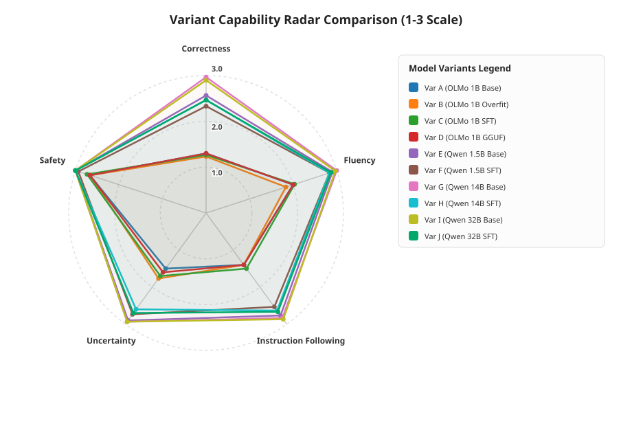

### 3. Pairwise findings

| Comparison | Mean difference | Repository verdict | Interpretation |
|:---|---:|:---:|:---|
| OLMo base A → OLMo pilot C | `+0.073` | Tied | Slight improvement, below the report's heuristic threshold |
| Qwen 1.5B base E → tuned F | `-0.154` | Regressed | Small but consistent aggregate decline |
| Qwen 14B base G → tuned H | `-0.240` | Regressed | Largest observed adaptation decline |
| Qwen 32B base I → tuned J | `-0.193` | Regressed | Adapted model remained strong but below its base |
| OLMo base A → Qwen 1.5B base E | `+1.053` | Improved | Base-model multilingual capability dominated the adaptation effect |
| Qwen 1.5B base E → Qwen 14B base G | `+0.120` | Tied | Higher scale gave only a modest gain on this small benchmark |
| Qwen 14B base G → Qwen 32B base I | `-0.013` | Tied | 32B provided no measurable aggregate advantage here |

The repository labels differences above `+0.15` as improved, below `-0.15` as regressed, and values in between as tied. This is a descriptive heuristic, not a hypothesis test or a statistical-significance threshold.

### 4. Interpretation

The most defensible interpretation is:

- **Base-model choice was the strongest factor.** Even the 1.5B Qwen base substantially outperformed the similarly sized OLMo base on this Vietnamese benchmark.
- **The pilot SFT data did not reliably improve general capability.** The data may be too small, too stylistically uniform, insufficiently diverse, or optimized more for concise response patterns than for new knowledge and reasoning.
- **Fine-tuning improved output control.** Every pilot adapter reduced token-ceiling hits, often to zero, and reduced average response latency by generating fewer tokens.
- **The 14B/32B regressions cannot be assigned to model scale alone.** Their MLX adapters cover more module types, only the final 16 blocks, and train on the full chat sequence, unlike the CUDA completion-only adapters.
- **Larger was not automatically better.** Qwen 14B and 32B bases were effectively tied, while 14B was considerably faster on the recorded Apple Silicon setup.
- **Overfitting and generalization are separate results.** Variant B proves that the model can learn the tiny corpus; it does not prove that the same configuration improves unseen prompts.
- **Qwen2.5-1.5B is the strongest small-model candidate in this pilot.** It combines a high judge mean with a training configuration that fit the 4 GB CUDA constraint, although its pilot adapter should be redesigned before use.

## Claims the report may and may not make

| Supported by current evidence | Not supported by current evidence |
|:---|:---|
| QLoRA training of the tested 1B–1.5B models fit within 4 GB VRAM. | The project has comprehensively evaluated Vietnamese language ability. |
| The tiny-overfit gate verified learning, adapter saving, reloading, and base-checkpoint immutability. | The 1,800-record dataset improves every model or model scale. |
| The selected multilingual Qwen base outperformed the English-dominant OLMo base on this benchmark. | LoRA or offline inference automatically guarantees privacy or security. |
| The pilot adapters shortened outputs and reduced token-limit truncation. | The complete research workflow is offline; the current judge uses a hosted API. |
| The current Qwen adapters regressed under the recorded LLM-judge protocol. | Variant D demonstrates successful merged GGUF deployment. |
| The dataset passed the implemented automated and human-review gates. | Zero detected PII proves that the data is anonymous or risk-free. |

## Validity and academic-integrity warnings

These points must appear in the final report rather than being hidden in an appendix:

1. **The main comparison is LLM-judged.** `results/evaluation/human_scores_matrix.json` records `judge_model: gpt-4o-mini`. Refer to it as automated LLM-as-a-judge evaluation.
2. **Judge failures are not auditable in the current matrix.** The judging script substitutes the fixed score pattern `{2, 2, 2, 2, 3}` when an API request fails but does not mark the record as a fallback. Twenty-four stored rows match that exact pattern; they may be legitimate scores or silent fallbacks.
3. **Blinded human comparison is unfinished.** The early OLMo baseline has manual scores, but no completed blinded A–J human matrix or inter-rater agreement analysis is committed.
4. **Variant D is not valid deployment evidence.** Its configuration has no adapter, and its generated-text hash currently matches Variant A exactly. The current D artifact behaves as a duplicate base run, not a verified merged GGUF model.
5. **Evaluation memory bars are estimates.** Variant summaries recorded `0.0` peak memory, and `scripts/analyze_results.py` substitutes a hard-coded fallback map. Treat those values as planning estimates, not measurements. The CUDA training-memory values in the training summaries are measured.
6. **The CUDA and MLX adapters are different experimental treatments.** CUDA adapts only query/value projections in every block with completion-only loss and seed 42; the saved MLX runs adapt all attention/MLP projections in the last 16 blocks with full-chat loss and seed 0. Model-scale comparisons are therefore also fine-tuning-architecture comparisons.
7. **The MLX YAML and completed adapters differ.** The wrapper does not forward several YAML LoRA fields, so citing only `configs/sft/pilot_sft_qwen14b_mlx.yaml` or the 32B equivalent would misreport the executed run. Cite the generated `adapter_config.json` and adapter tensor structure as well.
8. **MLX validation naming needs correction for reproduction.** The canonical pipeline emits `validation.jsonl`, whereas `mlx_lm` loads `valid.jsonl`. A derived MLX data directory or symlink is required if validation is to be used in a rerun.
9. **The benchmark is small.** Thirty prompts and five prompts per category produce wide uncertainty and make per-category conclusions fragile.
10. **Repeated-seed evidence is missing.** CUDA runs record seed 42, while completed MLX adapter configurations record seed 0. Neither condition has multiple independent repeats.
11. **The base-model comparison is confounded.** OLMo and Qwen differ in architecture, tokenizer, pretraining corpus, alignment data, and parameter count; the study cannot attribute the full gap to multilingual pretraining alone.
12. **Hardware and inference engines are not controlled across all variants.** CUDA training, PyTorch evaluation, and Apple MLX results are useful engineering measurements, but their throughput values are not a pure model-size comparison.
13. **The early baseline is a separate protocol.** Its 0–3 manual scores and `39.87` tokens/s result should not be numerically combined with the later A–J run.
14. **The data is narrow.** Project-authored synthetic examples may overrepresent concise, normative answers and underrepresent dialects, informal Vietnamese, code-switching, and open-ended conversation.
15. **Privacy/security evaluation is incomplete.** PII screening and five benchmark safety prompts do not replace canary extraction, membership inference, jailbreak, and false-refusal studies.
16. **External artifacts affect reproducibility.** Full datasets, base weights, adapters, and checkpoints live outside Git and must be archived with checksums for assessors who need to reproduce the study.

## How to write the group report from this repository

Use the following structure rather than copying the repository's development history.

| Report section | Main content | Repository evidence |
|:---|:---|:---|
| **1. Introduction** | Vietnamese capability gap, offline/privacy motivation, consumer-hardware constraint, research questions | This README; early baseline report |
| **2. Related work** | LoRA, QLoRA, OLMo 2, Qwen2.5, MLX, Vietnamese NLP evaluation, privacy and memorization | Cite original papers and official model cards; these references are not yet collected in the repository |
| **3. Data and ethics** | Corpus construction, review, licensing, PII controls, split policy, limitations | [`docs/data-card.md`](docs/data-card.md), [`data/README.md`](data/README.md), dataset manifests |
| **4. Methodology** | Base architecture, CUDA QLoRA path, MLX LoRA path, actual adapter coverage, hyperparameters, benchmark freeze | [`configs/sft/`](configs/sft/), saved adapter configurations, training/evaluation source |
| **5. Implementation** | Data pipeline, collator, trainer, CUDA/MLX paths, external artifact layout | [`src/viemmo/`](src/viemmo/), [`scripts/`](scripts/), tests |
| **6. Experimental results** | Training gate, model scores, pairwise changes, throughput, truncation behavior | [`results/training/`](results/training/), [`results/evaluation/variants/`](results/evaluation/variants/), [`results/reports/`](results/reports/) |
| **7. Discussion** | Why base choice dominated, why SFT may regress, efficiency–quality trade-offs, threats to validity | Results and validity sections in this README |
| **8. Privacy, security, and responsible use** | What was checked, what remains untested, intended and prohibited uses | Data Card; privacy/security benchmark cases; validity warnings |
| **9. Conclusion and future work** | Answer each research question, avoid unsupported claims, propose better data and repeated experiments | Research-question table and supported-claims table |

### Recommended figures and tables

Include only figures whose measurement status is clear:

- the end-to-end and fine-tuning architecture diagrams in this README;
- a table comparing CUDA all-layer `q/v` LoRA with MLX final-16-block all-linear LoRA;
- the five-dimension variant radar chart;
- the tiny-overfit loss curve from [`results/training/loss_curve.svg`](results/training/loss_curve.svg);
- a base-versus-adapter score table for A/C, E/F, G/H, and I/J;
- an output-control table showing latency and token-ceiling hits;
- a dataset composition table by category;
- a measured CUDA training-memory table.

Do not publish the generated memory comparison as measured telemetry until the fallback estimates have been replaced with real measurements.

### Team contribution record

Replace the placeholders with auditable contributions. The final report should also describe how each contribution was reviewed by another member.

| Member / student ID | Technical responsibility | Evidence produced or reviewed | Report sections | Verification by |
|:---|:---|:---|:---|:---|
| _Member 1_ | _e.g. data and ethics_ | _manifest, review log, tests_ | _Sections 3 and 8_ | _Member 2_ |
| _Member 2_ | _e.g. CUDA training_ | _configs, run summaries, adapter manifest_ | _Sections 4–6_ | _Member 3_ |
| _Member 3_ | _e.g. MLX evaluation_ | _variant outputs and summaries_ | _Sections 5–7_ | _Member 4_ |
| _Member 4_ | _e.g. statistics and writing_ | _comparison report, figures, limitations_ | _Sections 1, 6, 7, 9_ | _Member 1_ |

### Citation checklist

The bibliography should cite authoritative sources for:

- LoRA and QLoRA;
- the OLMo 2 technical report and official model card;
- the Qwen2.5 technical report and model cards for each scale;
- MLX and `mlx-lm` for Apple Silicon training;
- Vietnamese NLP or LLM evaluation literature;
- LLM-as-a-judge reliability and known biases;
- privacy leakage, memorization, and canary extraction in language models;
- CC BY 4.0 for the project-authored dataset.

## Reproduction guide

### 1. Environment

From the Git repository root:

```bash
python -m venv .venv
source .venv/bin/activate
python -m pip install --upgrade pip
python -m pip install -r requirements.txt
export PYTHONPATH="$PWD/src"
cp .env.example .env
```

On Windows PowerShell, activate with `.venv\Scripts\Activate.ps1` and set `$env:PYTHONPATH = "$PWD\src"`.

Apple Silicon training additionally requires:

```bash
python -m pip install mlx mlx-lm
```

### 2. External artifact storage

Large or sensitive artifacts are deliberately stored beside the Git repository:

```text
workspace/
├── Viemmo/                 # Git repository
└── Viemmo-storage/         # Base models, full data, adapters, checkpoints
    ├── upstream/
    │   ├── OLMo-2-0425-1B-Instruct/
    │   └── Qwen2.5-1.5B-Instruct/
    ├── datasets/
    │   ├── tiny-sft-v1/
    │   └── pilot-sft-v1/
    ├── adapters/
    │   ├── tiny-overfit-v1/
    │   ├── pilot-vietnamese-lora-v1/
    │   ├── pilot-qwen15b-lora-v1/
    │   ├── pilot-qwen14b-mlx-lora-v1/
    │   └── pilot-qwen32b-mlx-lora-v1/
    ├── checkpoints/
    ├── merged/
    ├── cache/              # Optional project-local Hugging Face cache
    └── gguf/
```

Internal team members obtain the frozen external dataset archive through the project-managed OneDrive workspace. Extract it under `Viemmo-storage/datasets/` without replacing the tracked manifests in Git. Base checkpoints and MLX model snapshots must be retrieved separately and treated as immutable inputs. MLX snapshots may reside in `HF_HOME` or the user's default Hugging Face cache unless `HF_HOME` is redirected into `Viemmo-storage/cache/`.

Export the paths in the active shell. You may also mirror them in `.env` for entry points that load dotenv automatically:

```bash
export LLM_STORAGE_ROOT="../Viemmo-storage"
export MODEL_PATH="$LLM_STORAGE_ROOT/upstream/OLMo-2-0425-1B-Instruct"
export HF_HUB_OFFLINE=1
export TRANSFORMERS_OFFLINE=1
export HF_DATASETS_OFFLINE=1
```

Never commit `.env`, model weights, private review material, quarantined text, full canary contexts, or external datasets.

### 3. Verify the tracked project

```bash
python -m pytest -q
python scripts/validate_dataset.py
python scripts/prepare_dataset.py validate
```

At the time of this README rewrite, the test suite reports `44 passed, 1 skipped`.

To rebuild the reviewed external pilot corpus:

```bash
python scripts/prepare_dataset.py build \
  --config configs/datasets/pilot-sft-v1.yaml
```

### 4. Train adapters

Tiny overfit gate:

```bash
python scripts/train_qlora.py \
  --config configs/sft/tiny_overfit.yaml \
  --dataset data/training/tiny-sft-v1.jsonl \
  --output-dir "$LLM_STORAGE_ROOT/adapters/tiny-overfit-v1" \
  --result-log results/training/tiny-overfit-run.json

python scripts/verify_adapter.py
```

CUDA pilot example:

```bash
python scripts/train_qlora.py \
  --config configs/sft/pilot_sft_qwen15b.yaml \
  --dataset "$LLM_STORAGE_ROOT/datasets/pilot-sft-v1/train.jsonl" \
  --val-dataset "$LLM_STORAGE_ROOT/datasets/pilot-sft-v1/validation.jsonl" \
  --output-dir "$LLM_STORAGE_ROOT/adapters/pilot-qwen15b-lora-v1"
```

Apple MLX pilot example:

```bash
MLX_DATA="$LLM_STORAGE_ROOT/datasets/pilot-sft-v1-mlx"
mkdir -p "$MLX_DATA"
ln -sf "$LLM_STORAGE_ROOT/datasets/pilot-sft-v1/train.jsonl" "$MLX_DATA/train.jsonl"
ln -sf "$LLM_STORAGE_ROOT/datasets/pilot-sft-v1/validation.jsonl" "$MLX_DATA/valid.jsonl"

python scripts/train_mlx.py \
  --config configs/sft/pilot_sft_qwen14b_mlx.yaml \
  --data "$MLX_DATA"
```

This command reproduces the wrapper's current MLX behavior. It does not enforce every LoRA field written in the YAML; compare the resulting `adapter_config.json` before treating two runs as equivalent.

### 5. Evaluate and analyze

Run only variants whose model and adapter artifacts are available and verified:

```bash
python scripts/evaluate_variants.py --variant A
python scripts/evaluate_variants.py --variant C
python scripts/evaluate_variants.py --variant E
python scripts/evaluate_variants.py --variant F
python scripts/analyze_results.py
```

`scripts/analyze_results.py` can regenerate the stored descriptive report and figures without calling an external API, using the existing score matrix.

The LLM-judge step requires network access and an OpenAI API key. It is optional, incurs external cost, and overwrites the comparison matrix unless another output path is supplied:

```bash
python scripts/run_llm_judge.py \
  --results-dir results/evaluation/variants \
  --output-matrix results/evaluation/llm_judge_scores_matrix.json \
  --model gpt-4o-mini

python scripts/analyze_results.py \
  --human-scores results/evaluation/llm_judge_scores_matrix.json
```

For human evaluation, prepare a deterministic blinded pack:

```bash
python scripts/prepare_blind_eval.py --mode prepare --seed 42
```

Keep the anonymization key separate from reviewers. Process completed scores only after review is locked.

## Repository map

```text
Viemmo/
├── README.md                         # Academic report guide and current findings
├── configs/
│   ├── datasets/                     # Dataset build acceptance criteria
│   ├── evaluation/                   # Frozen generation and variant definitions
│   └── sft/                          # CUDA and MLX training configurations
├── data/
│   ├── evaluation/                   # Frozen 30-prompt benchmark
│   ├── training/                     # Tracked tiny-overfit dataset
│   ├── manifests/                    # Counts, provenance, and checksums
│   └── reports/                      # Dataset preparation summaries
├── docs/
│   ├── data-card.md                  # Dataset methods, risks, and limitations
│   ├── training-report.md            # Tiny-run performance summary
│   └── model-cards/                  # Adapter documentation
├── manifests/model-checksums/        # Base and adapter integrity records
├── results/
│   ├── baseline/                     # Architecture and smoke-test evidence
│   ├── training/                     # Training metrics and figures
│   ├── evaluation/                   # Baseline and A–J output artifacts
│   └── reports/                      # Aggregated comparison and figures
├── scripts/                          # Reproduction entry points
├── src/viemmo/                       # Data and training implementation
└── tests/                            # Unit and end-to-end pipeline tests
```

## Submission checklist

Before treating the repository as the final group report package:

- [ ] Fill in the group metadata and contribution record.
- [ ] Freeze and cite the exact Git commit used for all reported tables.
- [ ] Add authoritative academic citations and a bibliography.
- [ ] Complete blinded human review with at least two reviewers and report agreement.
- [ ] Re-run important training conditions with multiple seeds if time permits.
- [ ] Reconcile the MLX wrapper with its YAML configuration and record an exact training summary.
- [ ] Provide `valid.jsonl` to MLX or update the loader integration so validation is reproducible.
- [ ] Replace fallback memory estimates with measured CUDA/MLX/CPU telemetry.
- [ ] Implement and genuinely evaluate the merged GGUF Variant D, or remove it from the final comparison.
- [ ] Complete dedicated privacy-canary and security-robustness experiments.
- [ ] Archive external datasets, adapters, and checkpoints with access instructions and checksums.
- [ ] Confirm code and model licensing before redistribution.
- [ ] Make the conclusion answer each research question without exceeding the evidence.

## Responsible-use statement

Viemmo is a research pilot, not a production assistant. It is not intended for high-impact decisions in education, employment, health care, finance, policing, immigration, or legal services. The current results do not establish safety, factual reliability, anonymity, resistance to extraction, or suitability for deployment. Any future release should include completed human evaluation, privacy and security testing, a corrected model card, exact artifact checksums, and explicit known limitations.
